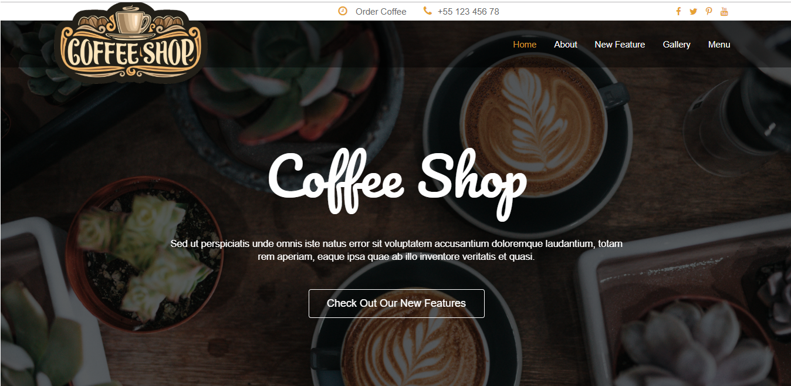
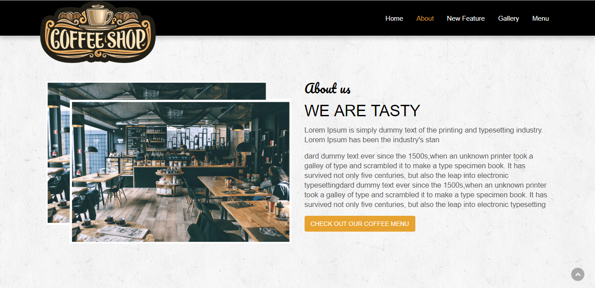
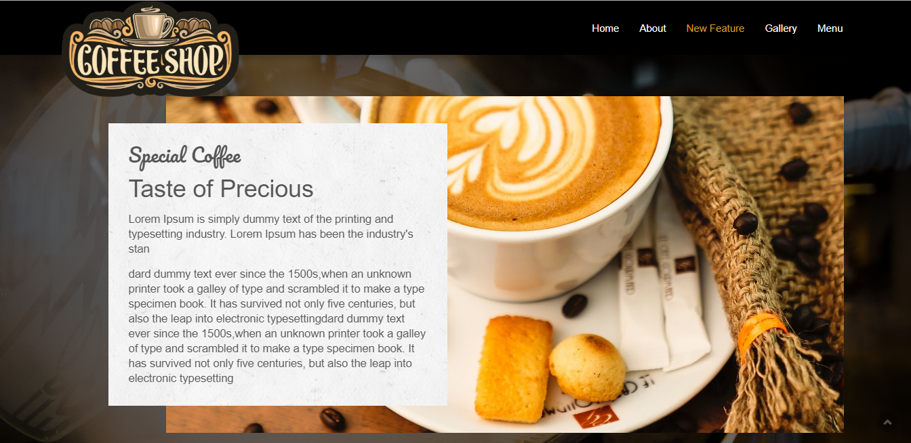
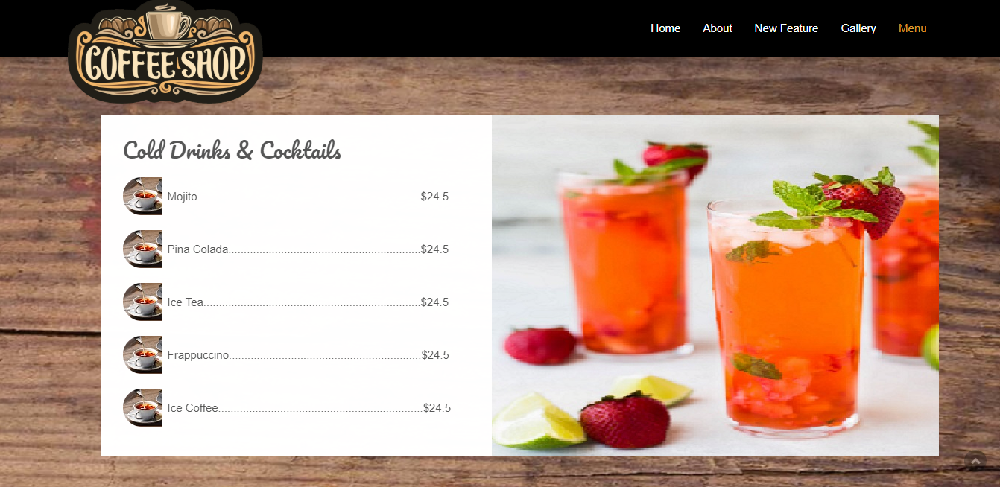
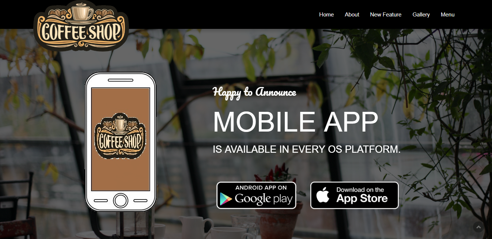
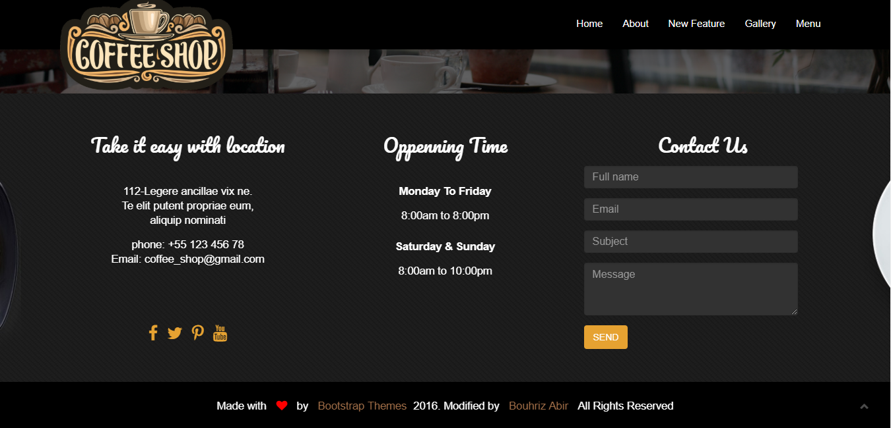

# Coffee-Shop-Website
https://abir-bouhriz.github.io/Coffee-Shop-Website/

## Description:
Coffee Shop is a daily necessity for local coffee addicts, a place to dream of, as you try to escape the daily stresses of life and just a comfortable place to meet your friends or to read a book, all in one.

## Tools & languages:
* HTML
* CSS
* JavaScript
* Visual Studio Code ( Text editor )
* paint.net ( image editor)

## ScreenShots:

## Mobile UI Link:
[Jet-CoffeShop](https://github.com/Mohammed-Benotmane/Jet-Coffee-Shop)

## Contribution:
Feel free to fork this project and add whatever you like. If you have any suggestions or any comments please feel free to contact me or to open an issue.

## Team:
[Jetlighters](https://github.com/JetLightStudio) having fun.
